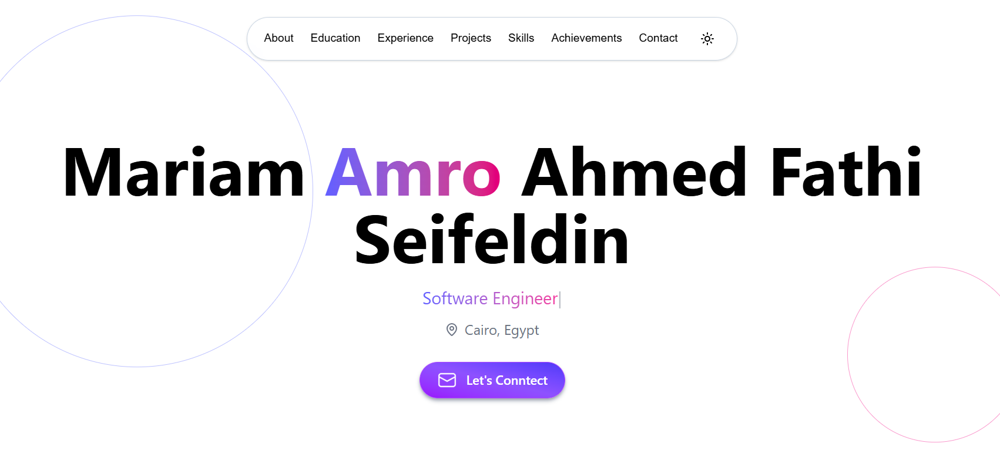

# Mariam Amro Ahmed Fathi Seifeldin | Full Stack Developer Portfolio

[](https://fullstack-portifolio-blond.vercel.app/)
[](https://nextjs.org/)
[](https://www.typescriptlang.org/)
[](https://tailwindcss.com/)

A modern, single-page portfolio website showcasing my work as a **Full Stack Developer**. Built with Next.js 15, TypeScript, and Tailwind CSS.



## ✨ Features

### 🎯 Focused Content

- **Full Stack Development** emphasis with React, Next.js, Spring Boot, and TypeScript
- **5+ projects** including HealMeals, Furniture Home, ReelVerse, and more
- **Achievements section** highlighting frontend committee recognition
- **Comprehensive skills** across frontend, backend, and tools

### 🧭 Navigation

- Smooth scrolling between sections
- Responsive navbar with mobile hamburger menu
- Active section highlighting
- Dark/light mode toggle

### 📱 Sections

- **Hero** - Animated typing effect with role descriptions
- **About** - Personal bio with contact links and resume
- **Education** - Academic background and coursework
- **Experience** - Professional internships and contributions
- **Projects** - Featured full-stack applications
- **Skills** - Categorized technical proficiencies
- **Achievements** - Awards and recognition
- **Contact** - Social links and contact information

## 🛠️ Tech Stack

- **Framework**: [Next.js 16](https://nextjs.org/) (App Router)
- **Language**: [TypeScript](https://www.typescriptlang.org/)
- **Styling**: [Tailwind CSS v4](https://tailwindcss.com/)
- **Animations**: [Framer Motion](https://www.framer.com/motion/)
- **Icons**: [Lucide React](https://lucide.dev/)
- **Theme**: [next-themes](https://github.com/pacocoursey/next-themes)
- **Deployment**: [Vercel](https://vercel.com/)

## 📁 Project Structure

```
├── app/
│   ├── page.tsx                    # Main portfolio page
│   ├── layout.tsx                   # Root layout with metadata
│   ├── providers.tsx                 # Theme provider
│   └── globals.css                    # Global styles
├── components/
│   ├── sections/                      # Page sections
│   │   ├── Hero.tsx
│   │   ├── About.tsx
│   │   ├── Education.tsx
│   │   ├── Experience.tsx
│   │   ├── Projects.tsx
│   │   ├── Skills.tsx
│   │   ├── Achievements.tsx
│   │   └── Contact.tsx
│   └── ui/                             # Reusable components
│       ├── Navbar.tsx
│       ├── ThemeToggle.tsx
│       ├── ProjectCard.tsx
│       └── ...
├── lib/
│   ├── data.ts                         # Fullstack content
│   └── types.ts                         # TypeScript interfaces
└── public/
    ├── profile1.jpeg
    ├── HealMeals-Cover.png
    ├── FurnitureHome-Cover.png
    └── ...
```

## 🚀 Getting Started

### Prerequisites

- Node.js 18+ 
- npm or yarn

### Installation

1. Clone the repository

```bash
git clone https://github.com/Mariam-Amro-2005/Fullstack-Portifolio.git
cd fullstack-portfolio
```

2. Install dependencies

```bash
npm install
# or
yarn install
```

3. Run the development server

```bash
npm run dev
# or
yarn dev
```

4. Open [http://localhost:3000](http://localhost:3000) in your browser

### Build for Production

```bash
npm run build
npm start
```

## 🎨 Color Scheme

- **Primary**: Indigo/Pink gradient
- **Accent**: Purple tones for highlights
- **Dark mode**: Optimized dark theme with adjusted contrasts

## 📱 Responsive Design

- **Desktop**: Full experience with all sections visible
- **Tablet**: Adjusted layouts for medium screens
- **Mobile**: Collapsible navbar and optimized spacing

## 🌙 Dark Mode

Supports system preference and manual toggle with persistent storage. All components are styled for both light and dark themes.

## 🚢 Deployment

The site is deployed on Vercel with automatic deployments from the main branch.

[View Live Site](https://fullstack-portifolio-blond.vercel.app/)

## 📄 License

This project is open source and available under the [MIT License](LICENSE.txt).

## 👩‍💻 Author

### Mariam Seifeldin

- LinkedIn: [mariam-seifeldin](https://www.linkedin.com/in/mariam-seifeldin/)
- GitHub: [@Mariam-Amro-2005](https://github.com/Mariam-Amro-2005)
- Email: [mariam.seifeldin.2005@gmail.com](mariam.seifeldin.2005@gmail.com)

## 🙏 Acknowledgments

- Icons by [Icons8](https://icons8.com/)
- Built with [Next.js](https://nextjs.org/)
- Deployed on [Vercel](https://vercel.com/)
